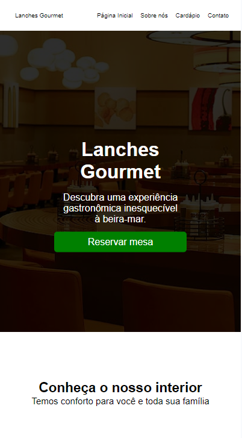
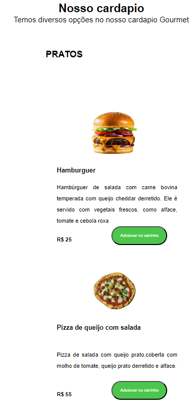
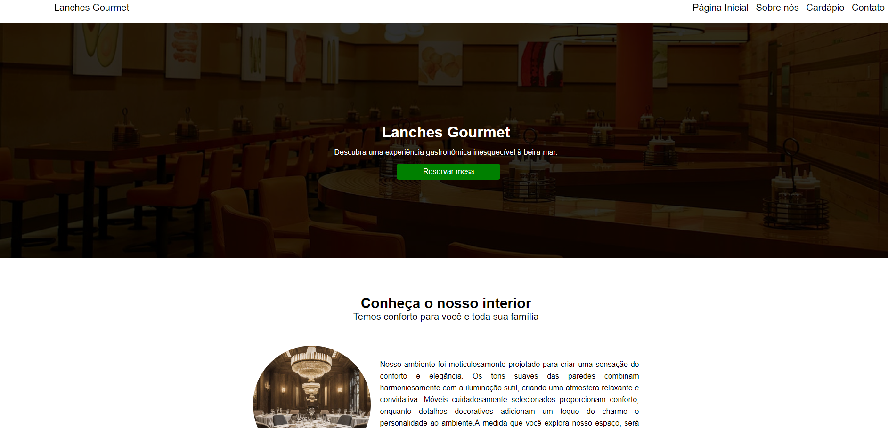
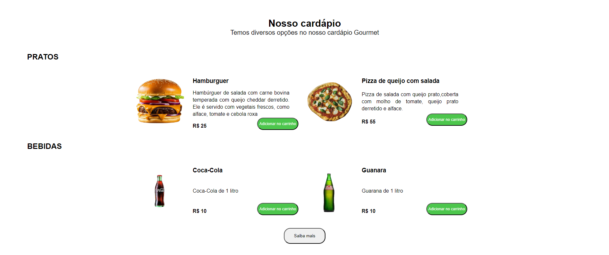

# Sobre o projeto

https://lanchesgourmet.vercel.app/

Este projeto foi desenvolvido usando HTML, CSS e JavaScript para criar um site de uma lanchonete. Ele apresenta várias seções importantes para os clientes conhecerem melhor os serviços oferecidos.

Na seção "Sobre a Lanchonete", os visitantes podem explorar informações detalhadas sobre a história, valores e missão do estabelecimento. O cardápio diversificado inclui opções como pizzas, hambúrgueres e refrigerantes, permitindo aos usuários visualizar as escolhas disponíveis e suas descrições. Os clientes podem adicionar os produtos do cardápio ao carrinho e, em seguida, enviar as opções selecionadas diretamente para o WhatsApp do estabelecimento. Destacamos as vantagens do serviço de delivery oferecido pela lanchonete, informando aos clientes sobre a conveniência e os benefícios de receber os pedidos em casa. Além disso, detalhamos as formas de pagamento aceitas, explicando cada opção disponível para garantir uma experiência de compra conveniente. Também fornecemos informações sobre a localização da lanchonete, facilitando para os clientes encontrarem o estabelecimento.

Este projeto foi desenvolvido com o objetivo de proporcionar uma plataforma intuitiva e acessível, focada em facilitar a compra de lanches para os clientes, enquanto oferece uma interface amigável e informativa.

## Layout mobile
### Imagem da Localização 



### Imagem da escolha dos Móveis 

 


## Layout web
### Imagem da Localização 



### Imagem da escolha dos móveis





# Tecnologias utilizadas

## Front end
- HTML 
- CSS
- JavaScript


# Como executar o projeto


## Front end web

```bash
# clonar repositório
git clone https://github.com/RRodrigoCordeiro/aluguel-imoveis-website.git

# abra o projeto
Navegue até o diretório do projeto

# executar o projeto
Abra arquivo "index.html" em um navegador da web
```
# Status do projeto

Em desenvolvimento

# Autor

Rodrigo Cordeiro

https://www.linkedin.com/in/rodrigo-cordeiro-4687992ab/
